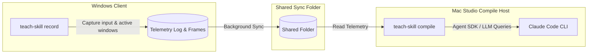

# Teach Skill — Cross-Platform Telemetry Recorder & Claude Code Compiler

Do a task once on Windows, compile it into an automation blueprint on Mac, and teach Claude Code new skills forever!

**Teach Skill** is an open-source toolchain that watches what you do on your Windows desktop — which apps you use, how you navigate, and what you type — and automatically compiles that workflow into a reusable [Claude Code Skill](https://docs.anthropic.com/en/docs/claude-code/skills) (`SKILL.md`). 

It is designed with a **split-host cross-platform architecture**:
- **Windows Client**: Captures telemetry, screenshots, and window switches via a lightweight tray application.
- **macOS/Linux Compile Host**: Processes the telemetry timeline through the **Claude Agent SDK** to generate structured skills, requiring zero credentials or LLM setups on the recording client.

---

## Key Features

- 🖥️ **Split-Host Syncing**: Record workflows on a personal laptop; compile them instantly on your high-powered developer machine (e.g. via Dropbox sync).
- 🔑 **Secure Keylogger Mode**: Toggleable character capture that securely reconstructs your typing in real-time, including space/newline processing and intelligent backspace correction.
- 🛡️ **Privacy Shield**: Automated redactors that strip passwords, multi-factor authentication (MFA/Okta) screens, and sensitive titles before they hit the compiler.
- ⚡ **Desktop Shortcuts**: One-click tester installer (`install.ps1`) that automatically deploys a ready-to-run `.bat` launcher on your Windows Desktop.
- 🤖 **Agent SDK Compilation**: Seamless integration with the Claude Agent SDK async generator with dynamic turn handling (`max_turns: 15`).

---

## Quick Start (macOS / Compiler Host)

To compile recorded telemetry into skills:

```bash
# Clone the repository
git clone <your-repo-url>
cd teach-skill

# Set up environment
python3 -m venv .venv
source .venv/bin/activate

# Install compiler dependencies
pip install -e .
```

To compile a `.jsonl` telemetry file into a skill:
```bash
teach-skill compile path/to/recording.jsonl --yes --local
```

---

## Tester Setup (Windows / Recorder Client)

We make testing incredibly easy. If you are distributing this to other testers:

1. Package the folder (excluding `.venv` and `.git` caches).
2. The tester simply unzips it and runs **`install.ps1`** (Right-click -> **Run with PowerShell**).
3. This creates a **`Start Teach Skill`** shortcut directly on their Windows Desktop!
4. They double-click to record, and right-click the red circle tray icon to stop.

---

## How It Works



1. **Record**: The tray app logs window switches, click/keystroke counts, and clipboard text as you perform a task.
2. **Compile**: The compiler reads the timeline, reconstructs your exact flow, and queries Claude to write the `SKILL.md` blueprint.
3. **Save**: Save skills locally to your project's `.claude/skills/` folder or globally for all developer workspaces on your machine.

---

## Development & Test Suite

The project comes with a comprehensive, robust test suite covering parsers, clipboard monitors, privacy redaction, and CLI workflows:

```bash
# Run unit tests
pytest tests/ -v
```

---

## License

MIT

