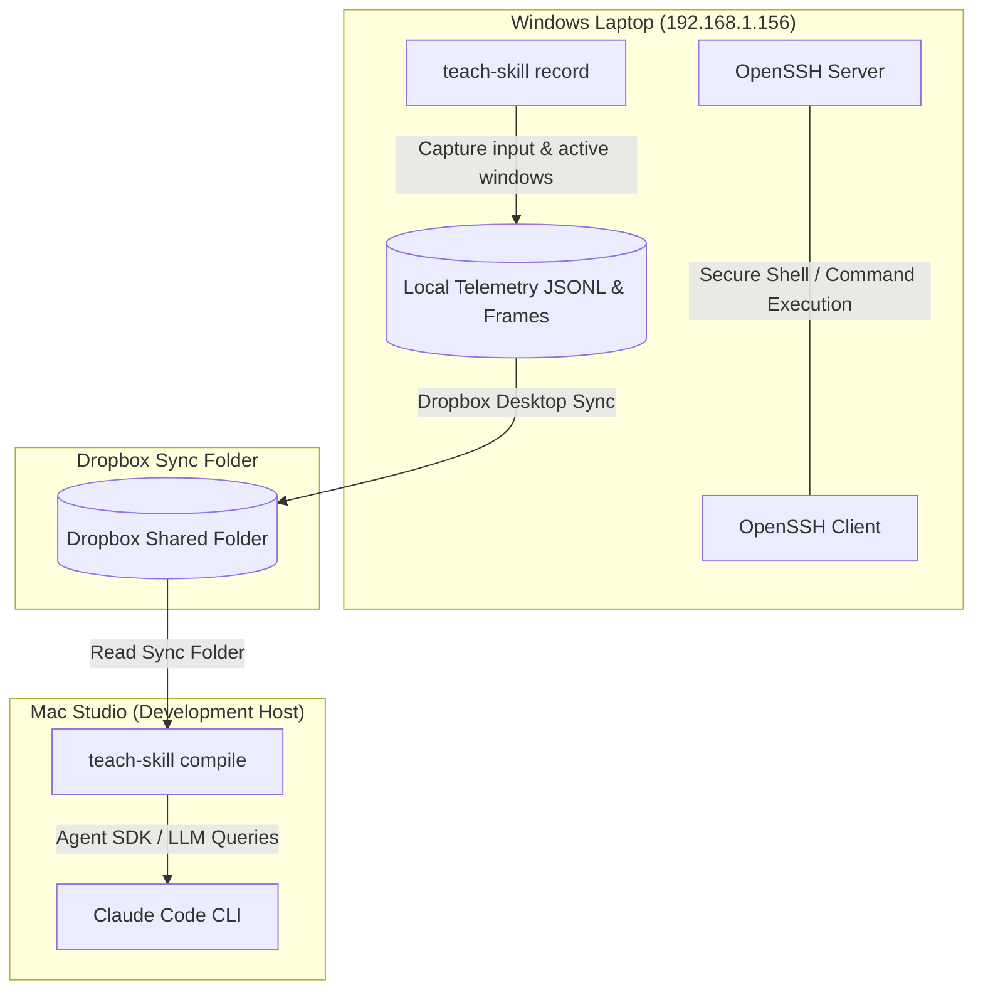

# Teach Skill - Cross-Platform Development & Sync Guide

This document outlines the architecture, network route, SSH configuration, keylogger features, and step-by-step guides for running personal compile loops and distributing the Windows recorder to testers.

---

## 1. Project Architecture

The system utilizes a split-host design: a **Windows Recorder** captures desktop actions (keystrokes, mouse clicks, and active window titles) and a **Mac Studio Compiler** processes that data via the Claude Agent SDK to generate structured `SKILL.md` skill blueprints.



---

## 2. Personal Setup & Connection Verification

The Mac Studio accesses the Windows Laptop remotely without password prompts using a secure OpenSSH key pair.

### Mac Studio Commands
- **Key Generation**: `ssh-keygen -t ed25519 -N "" -f ~/.ssh/id_ed25519`
- **Verify Passwordless Link**:
  ```bash
  ssh -o BatchMode=yes -o ConnectTimeout=3 marti@192.168.1.156 "echo success"
  ```
- **Remote Windows PowerShell Execution**:
  ```bash
  ssh marti@192.168.1.156 "powershell -Command \"Get-Service sshd\""
  ```

### Windows Laptop Commands (PowerShell as Admin)
If you ever need to re-install or re-authorize the SSH Server:
```powershell
# Install OpenSSH Server
Add-WindowsCapability -Online -Name OpenSSH.Server~~~~0.0.1.0

# Start and set to automatic
Start-Service sshd
Set-Service -Name sshd -StartupType 'Automatic'

# Open Firewall Port 22
New-NetFirewallRule -Name sshd -DisplayName 'OpenSSH Server (sshd)' -Enabled True -Direction Inbound -Protocol TCP -Action Allow -LocalPort 22
```

---

## 3. Enable / Disable Raw Keystroke Capturing

For maximum privacy, **raw character logging is disabled by default**. The recorder only tracks the total count of key presses (e.g., `keystroke_count: 47`).

If you want the compiler to capture the exact characters you type (useful for automating spreadsheet formulas, specific terminal commands, or file names):

1. Open `C:\Users\marti\.teach-skill\config.json` on the Windows Laptop.
2. Toggle `"capture_raw_keystrokes"` to `true`:
   ```json
   {
     "hotkey_toggle": "ctrl+shift+t",
     "hotkey_pause": "ctrl+shift+p",
     "storage_path": "C:\\Users\\marti\\Dropbox\\sync\\recordings",
     "screenshot_resolution": "native",
     "privacy_filter": true,
     "capture_raw_keystrokes": true
   }
   ```
3. The recorder will now securely reconstruct your typing locally (supporting letters, symbols, spaces, newlines, and gracefully correcting typing errors when you hit `Backspace`).

---

## 4. Development Watcher & Compile Loop

To automate the development process, an active watch script on your Mac Studio continuously scans for new Dropbox recording folders and instantly compiles them.

### Mac Watcher Launch
```bash
python3 ~/scripts/teach_skill_watcher.py
```
*Leave this terminal window open. It polls for recordings every 5 seconds, compiles them via the Agent SDK, and saves the output locally under `.claude/skills/`.*

### Compilation Options (Manual)
To compile a recording manually without prompt blocks, run:
```bash
.venv/bin/teach-skill compile <recording.jsonl> --yes --local --name <custom-skill-name>
```

---

## 5. Sharing with External Testers

To share the Windows telemetry recorder with other Windows testers who already have the Claude Code CLI and Desktop app, distribute the lightweight package.

### Location of Tester Assets (Mac Studio)
- **PowerShell Installer**: `/Users/martinshin/projects/teach-skill-antigravity/install.ps1`
- **Tester Zip Package**: `/Users/martinshin/Library/CloudStorage/Dropbox/sync/teach-skill-antigravity.zip`

### Step-by-Step Tester Guide
Provide this guide to your testers:

1. **Unzip** the `teach-skill-antigravity.zip` archive into any directory.
2. **Right-click `install.ps1`** inside the folder and select **"Run with PowerShell"**.
   - This sets up the virtual environment, installs the required Windows tray libraries (`pystray`, `pynput`), and creates a shortcut named **"Start Teach Skill"** on their Windows Desktop.
3. **Double-click "Start Teach Skill"** on the Desktop to launch the recorder daemon.
4. Right-click the **red tray icon** and choose **"Stop Recording"** when finished.
5. Send the timestamped recording folder (located under `C:\Users\<Username>\.teach-skill\recordings\`) to the compile host!
